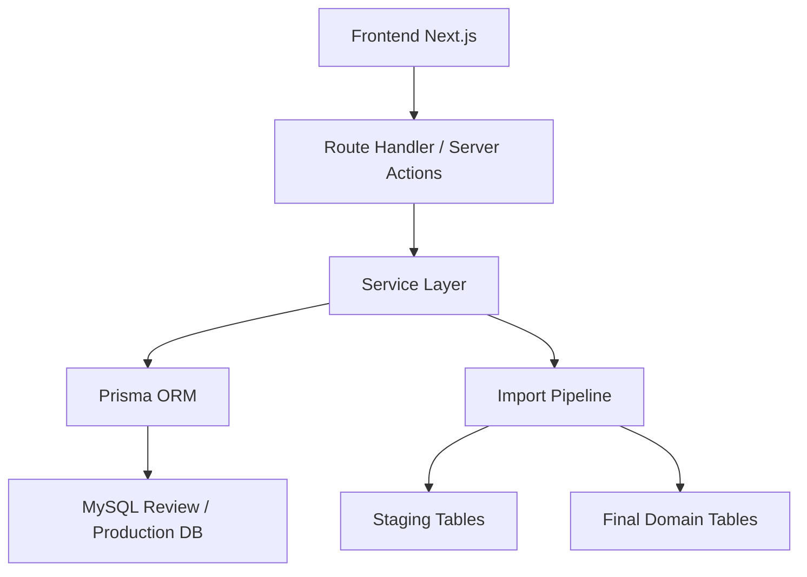
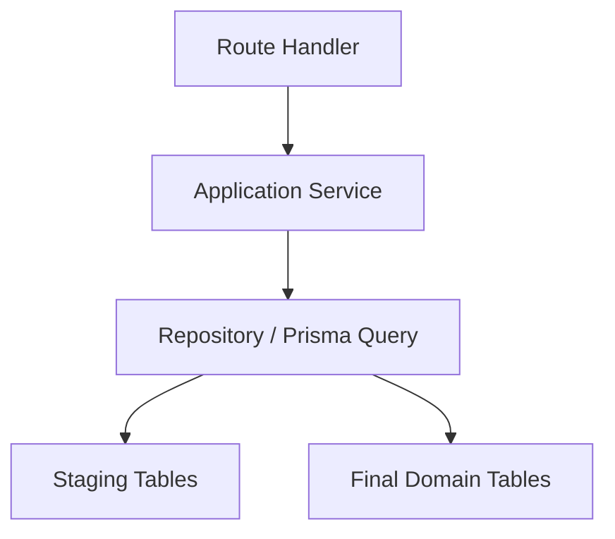
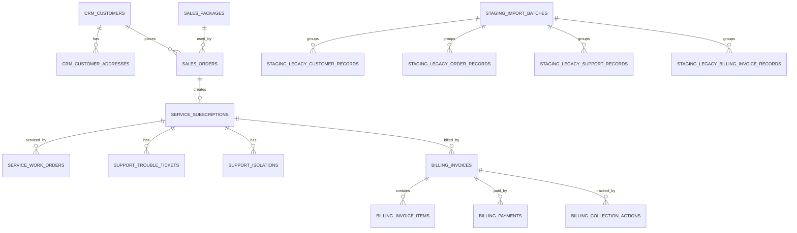

# Arsitektur Teknis Aplikasi Web Utama Perkasa ERP OSS BSS

## 1. Desain Arsitektur



## 2. Deskripsi Teknologi

- Frontend: `Next.js` + `React` + `TypeScript` + `Tailwind CSS`
- Inisialisasi: bootstrap aplikasi web utama di `apps/web`
- Backend: `Next.js Route Handlers` dan `Server Actions`
- ORM: `Prisma`
- Database: `MySQL` untuk review awal, lalu diarahkan ke database production setelah valid
- Deployment target: satu aplikasi web utama yang bisa dibungkus ke Android wrapper

## 3. Definisi Route

| Route | Tujuan |
|-------|--------|
| `/login` | Halaman login tunggal aplikasi |
| `/dashboard` | Dashboard utama lintas domain |
| `/import` | Daftar batch import dan status review |
| `/import/[batchId]` | Detail batch staging dan row review |
| `/sales` | Shell modul penjualan |
| `/customers` | Shell modul customer dan subscription |
| `/support` | Shell modul support |
| `/inventory` | Shell modul inventory dan network asset |
| `/hr` | Shell modul HR |
| `/billing` | Shell modul billing dan collection |
| `/settings/access` | Pengaturan role, permission, dan mapping akses |

## 4. Definisi API

### 4.1 Tipe Data Inti

```ts
export type ImportBatchSummary = {
  id: number
  batchCode: string
  sourceSystem: 'WEB_PSB' | 'FINANCE' | 'GA'
  importScope: string
  importStatus: 'DRAFT' | 'UPLOADED' | 'MAPPED' | 'VALIDATED' | 'IMPORTED' | 'FAILED'
  totalRows: number
  validRows: number
  invalidRows: number
  duplicateRows: number
}

export type ImportBatchDetailRow = {
  id: number
  legacyId: string | null
  normalizedKey: string | null
  importStatus: 'PENDING' | 'MAPPED' | 'VALID' | 'INVALID' | 'IMPORTED' | 'SKIPPED'
  validationNotes: string | null
  targetId: number | null
}

export type DashboardSummary = {
  customers: number
  orders: number
  troubleTickets: number
  isolations: number
  inventoryItems: number
  employees: number
  overdueInvoices: number
}
```

### 4.2 Endpoint Awal

| Method | Endpoint | Tujuan |
|--------|----------|--------|
| `POST` | `/api/auth/login` | Login internal |
| `GET` | `/api/dashboard/summary` | Mengambil KPI dashboard utama |
| `GET` | `/api/import/batches` | Mengambil daftar batch import |
| `GET` | `/api/import/batches/[id]` | Mengambil detail batch dan row review |
| `POST` | `/api/import/batches` | Membuat batch import baru |
| `POST` | `/api/import/batches/[id]/transform` | Menjalankan transform tahap tertentu |
| `GET` | `/api/modules/support/summary` | Ringkasan support |
| `GET` | `/api/modules/billing/summary` | Ringkasan billing |

## 5. Diagram Arsitektur Server



## 6. Model Data

### 6.1 Definisi Model Data



### 6.2 DDL dan Arah Implementasi

- schema review tetap memakai file SQL yang sudah ada di folder `database/`
- app web akan membaca tabel final dan tabel staging dari schema tunggal yang sama
- eksekusi transform tetap dipicu dari aplikasi, tetapi SQL review tetap menjadi baseline referensi

## 7. Keputusan Teknis Penting

1. aplikasi dibangun sebagai satu shell web utama, bukan multi-website
2. auth dan permission dibaca dari master bersama
3. dashboard dan modul harus membaca definisi backend yang sama
4. pusat import menjadi modul kelas satu, bukan utilitas samping
5. layout awal memakai desktop-first dengan kompatibilitas mobile dan Android wrapper
