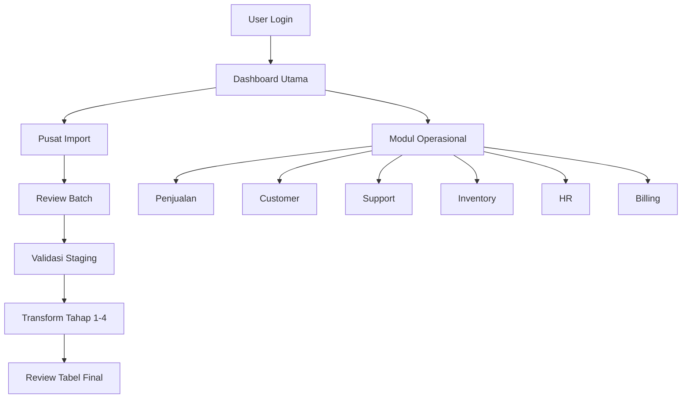

# PRD Aplikasi Web Utama Perkasa ERP OSS BSS

## 1. Gambaran Produk

Aplikasi ini adalah website utama tunggal untuk operasional ISP yang menyatukan penjualan, customer, support, inventory, HR, billing, dan dashboard ke dalam satu shell aplikasi.

- Produk ini menyelesaikan masalah fragmentasi tiga aplikasi lama dengan target akhir `1 database`, `1 domain`, dan `1 website`
- Nilai utamanya adalah kontrol operasional lintas divisi yang konsisten di desktop, mobile web, dan Android wrapper

## 2. Fitur Inti

### 2.1 Peran Pengguna

| Peran | Metode Akses | Hak Akses Inti |
|------|--------------|----------------|
| Super Admin | Login internal | Akses penuh lintas modul, pengaturan sistem, mapping import, dashboard global |
| Admin Divisi | Login internal | Mengakses modul operasional sesuai divisi dan dashboard terkait |
| Operator | Login internal | Menjalankan pekerjaan harian per modul tanpa akses konfigurasi global |

### 2.1.1 Perspektif Role dan Divisi Aktif

Implementasi web saat ini sudah berjalan dengan model role operasional yang lebih rinci daripada 3 role bootstrap PRD awal, yaitu:

1. `SUPER_ADMIN`
2. `SALES_MARKETING`
3. `CS_OPERATOR`
4. `CS_ADMIN`
5. `NOC_OPERATOR`
6. `FIELD_TECHNICIAN`
7. `TT_OPERATOR`
8. `DIGITAL_CREATOR`
9. `DISMANTLE_OPERATOR`

Keputusan fase implementasi saat ini:

1. `web-psb-perkasa` dijadikan fondasi Divisi `Pemasaran & Pelayanan`
2. migrasi tahap awal dipusatkan pada role dan flow di bawah `Pemasaran & Pelayanan`
3. divisi lain diintegrasikan setelah fondasi ini stabil di ERP

Pemisahan ini membuat web bisa:

1. memfilter sidebar berdasarkan role dan divisi
2. mengunci dashboard operasional ke divisi default role non-admin
3. menampilkan form, CTA, dan approval hanya bila role memiliki capability `create`, `update`, atau `approve`

Lampiran inventaris aktual yang memetakan seluruh role, divisi, menu, fitur, dan kolom tampilan web ada di:

- `docs/web-role-division-menu-feature-catalog.md`

### 2.2 Modul Fitur

1. **Halaman Login**: autentikasi tunggal, branding platform, akses satu pintu
2. **Dashboard Utama**: ringkasan KPI lintas domain, shortcut modul, status operasional harian
3. **Pusat Import & Review Data**: upload batch, review staging, mapping, validasi, transform per tahap
4. **Modul Operasional**: Penjualan, Customer, Support, Inventory, HR, Billing, Dashboard
5. **Halaman Detail Batch**: detail row staging, target id, status import, catatan validasi

### 2.3 Rincian Halaman

| Nama Halaman | Nama Modul | Deskripsi Fitur |
|-------------|------------|-----------------|
| Login | Form autentikasi | Login username/password, status akses, tombol masuk, pesan error yang jelas |
| Dashboard Utama | Ringkasan platform | KPI customer, order, TT, isolir, inventory, attendance, billing, shortcut modul |
| Dashboard Utama | Navigasi aplikasi | Sidebar domain, topbar context, pencarian cepat modul |
| Pusat Import | Daftar batch | Daftar batch import, sumber sistem, scope, status, jumlah valid/invalid |
| Pusat Import | Pipeline transform | Tombol eksekusi tahap 1-4, indikator dependency, histori eksekusi |
| Detail Batch | Tabel staging | Row staging, normalized key, status, validation notes, target id |
| Detail Batch | Filter dan review | Filter per domain, per status, per source, cari row bermasalah |
| Penjualan | Shell modul | Entry lead, coverage, order, survey, status order |
| Customer | Shell modul | Master customer, address, subscription, histori layanan |
| Support | Shell modul | Trouble ticket, isolir, dismantle history, SLA ringkas |
| Inventory | Shell modul | Item, stock movement, ODP/port, device assignment |
| HR | Shell modul | Employee, attendance, salary slip, loan |
| Billing | Shell modul | Invoice, payment, collection action, overdue status |

### 2.4 Inventaris Menu dan Kolom Operasional

PRD ini memakai dua lapis dokumentasi untuk perspektif web:

1. PRD utama ini menjelaskan tujuan produk, modul inti, dan arah pengalaman pengguna
2. lampiran `docs/web-role-division-menu-feature-catalog.md` menjadi inventaris aktual menu, fitur, dan kolom layar berdasarkan role/divisi

Lampiran tersebut wajib dijadikan acuan saat:

1. memverifikasi apakah sebuah role benar-benar bisa melihat menu tertentu
2. mengecek apakah sebuah capability write-side memang harus tampil atau disembunyikan
3. menulis test case UAT per role dan per domain

Untuk keputusan pilot dan cutover bertahap per role/divisi, gunakan juga:

- `docs/web-role-cutover-readiness.md`

Untuk blocker utama role bisnis lintas domain, gunakan PRD detail:

- `docs/web-list-kerja-terpadu-prd.md`

Untuk validasi fase awal Divisi `Pemasaran & Pelayanan`, gunakan checklist UAT khusus:

- `docs/web-pemasaran-pelayanan-uat-checklist.md`

Untuk spesifikasi implementasi modul pengganti menu legacy `list`, gunakan:

- `docs/web-list-kerja-terpadu-implementation-spec.md`

Untuk pengembangan dashboard configurable per manager divisi, gunakan:

- `docs/dashboard-kpi-customization-prd.md`

## 3. Proses Inti

User masuk ke satu website, melihat dashboard utama, lalu memilih modul atau pusat import. Untuk migrasi, admin menjalankan alur `batch -> staging -> mapping -> transform tahap 1-4 -> review hasil`. Untuk operasional harian, user mengakses domain sesuai permission dari shell aplikasi yang sama.

## 4. Desain Antarmuka

### 4.1 Gaya Desain

- Warna utama: slate gelap, abu netral, putih bersih, aksen biru dingin
- Gaya tombol: solid, rounded medium, kontras tinggi, hover tegas
- Font: display tegas untuk heading dan sans modern yang bersih untuk konten
- Layout: desktop-first dengan sidebar tetap, topbar utilitarian, card summary yang rapi
- Gaya ikon: outline tegas, profesional, tanpa ornamen berlebihan

### 4.2 Gambaran Desain Halaman

| Nama Halaman | Nama Modul | Elemen UI |
|-------------|------------|-----------|
| Login | Branding | panel kiri dengan identitas platform, panel kanan untuk form login |
| Dashboard Utama | KPI cards | card summary ringkas, grid modular, warna aksen per domain |
| Dashboard Utama | Navigasi | sidebar domain dengan label jelas dan state aktif kuat |
| Pusat Import | Batch table | tabel data padat, filter sticky, badge status, action bar |
| Detail Batch | Review rows | tabel lebar, drawer detail row, panel validation notes |
| Modul Operasional | Shell konten | header domain, toolbar filter, area konten modular |

### 4.3 Responsivitas

- pendekatan `desktop-first`
- sidebar berubah menjadi drawer di mobile
- tabel review memakai mode card/stacked row untuk layar sempit
- semua action utama harus aman disentuh di mobile web dan Android wrapper
