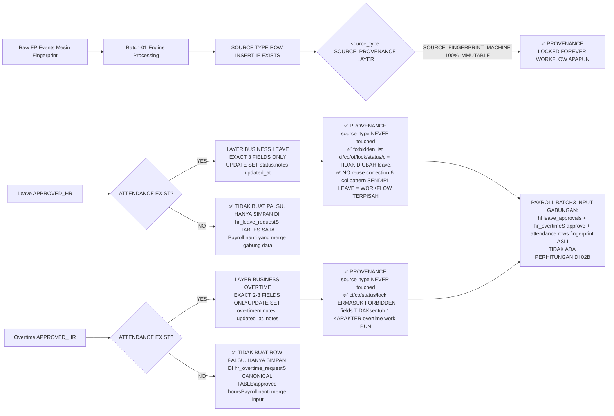

# HR-BATCH-02B — LEAVE (CUTI/IZIN/SAKIT) + OVERTIME (LEMBUR) SPECIFICATION

## Parent Context & Non-Goals Carry-Forward
- **Repository Baseline Exact**: `main @ da467b6646c633d057a331bdb270dde82088e437`
- **Prev Batch Reused Capability**: HR-Batch-01 (Employee Master, Supervisor FK relationship, Fingerprint-only Attendance, HrAudit infrastructure) + HR-Batch-02A (KARYAWAN Canonical Role, `/me` Trusted Identity, org_teams/positions, Document IDOR 3-layer Defense Pattern, Access Control Arrays, employee_code Unique Preflight)
- **Scope Locked FOREVER BATCH-02B EXCLUDED NON-GOALS** (rejected bila masuk diff):
  - ❌ Full Payroll Run, Payroll Calculation Engine, Payroll GL Posting Finance
  - ❌ PPh 21 / Pajak / BPJS Ketenagakerjaan / BPJS Kesehatan calculation apapun
  - ❌ Real Fingerprint Device SDK ZKTeco/vendor concrete connector implementation
  - ❌ Fingerprint Sync Cron Schedule / Background worker / BullMQ / Redis job
  - ❌ Device Credential Encryption AES at-rest / SEC-06 gate (Batch-03 scope)
  - ❌ BCDR (Backup Disaster Recovery) runbook / restore testing
  - ❌ Production Deployment Config change / Coolify / Vercel / K8s / Dockerfile.prod
  - ❌ Division/Branch CRUD apapun (Settings Owner scope)
  - ❌ Recruitment, Training, Performance Appraisal Full
  - ❌ Buka kembali Browser/Manual/Face/GPS/Geofence attendance source type POST create = TETAP RETURN 403 FOREVER from Batch-01
  - ❌ Mengubah `source_type` historical fingerprint (FP/FINGERPRINT_MACHINE) ke apapun = FORBIDDEN provenance rewrite gate
  - ❌ Menganggap field `attendance.overtime_hours` / `attendance.status` sebagai "workflow state" utama — hanya sebagai "snapshot output business approval". Workflow canonical state = `hr_leave_requests.status` + `hr_overtime_requests.status`.

---

## 1. PROBLEM STATEMENT

Saat ini Employee Request untuk **Cuti/Izin/Sakit** dan **Lembur (Overtime)** BELUM ADA implementasi workflow apapun di repository. Tidak ada approval chain Supervisor → HR Final Review. Tidak ada attendance integration otomatis ketika cuti approved (status attendance berubah business jadi SICK/PERMIT/LEAVE_APPROVED). Tidak ada otomatis `overtime_minutes` snapshot dari approved overtime request ke attendance row tanggal relevan.

## 2. USER PERSONAS (4 Roles, Exact Boundaries from Identity)

| Canonical Role | Scope Kewenangan | Identity Source Trusted |
|---|---|---|
| **KARYAWAN** | HANYA bisa create/list/edit-cancel/view milik sendiri | `session.userId` → `hr_employees.user_id` → employeeId |
| **SUPERVISOR** (bukan role enum baru, derived dari `hr_employees.supervisor_id` chain apakah employee lain supervisor_id = session.employeeId) | HANYA bisa approve/reject subordinates yang langsung melapor (direct reports). TIDAK bisa approve/reject orang luar chain. | `session.userId` → employee identity → `SELECT id FROM hr_employees WHERE supervisor_id = <me.id>` list subordinate scope |
| **HR (role enum HR, OWNER, SUPER_ADMIN, ADMIN = semua grouped sebagai HR Administrative Final)** | Final review/approve/reject SEMUA leave/overtime request. Bisa admin cancel. Bisa export approved list untuk payroll input. Tidak bisa approve untuk dirinya sendiri bila request leave/overtime tetap butuh supervisor approver lain (self-approve forbidden). | `canPerformAction(session.role, 'hr', 'approve')` baseline |
| **Roles lain (SALES_MARKETING, CS_OPERATOR, FINANCE, FIELD_TECHNICIAN, NOC, dll)** | Dilarang total access endpoint `/api/hr/leaves/*` dan `/api/hr/overtimes/*` kecuali jika role tersebut JUGA termasuk sebagai SUPERVISOR via relationship `hr_employees.supervisor_id` (approval subordinates) atau request milik sendiri (jika role tersebut juga mapping ke employee row user_id linked). Scope `OWN-REQUEST` tetap berlaku untuk role manapun yang memiliki linked identity. **TIDAK BOLEH** global administrative access HR diberikan ke FINANCE/CS/NOC/SALES tanpa explicit HR enum role. |

---

## 3. ACCEPTANCE CRITERIA (28 Items — type: `rule` atau `rubric`)

### 3.1 LEAVE TYPE MASTER (Quota/Periode) — AC-1 s/d AC-4
**Scope**: Tabel `hr_leave_types` + `hr_leave_balances` (jika balance memang diperlukan AC explicit rule. Bila tidak balance = no table).

- **AC-1 (rule)** — Leave type Master CRUD endpoint `/api/hr/leave-types` hanya bisa diakses oleh role set `{HR, OWNER, SA, ADMIN}`. KARYAWAN/SUPERVISOR non-HR = return 403 untuk write, GET list public allowed semua (view jenis cuti yang tersedia).
- **AC-2 (rule)** — Leave type memiliki fields: `code` UNIQUE, `name` (Cuti Tahunan, Cuti Sakit, Izin Khusus, Cuti Bersama, dll), `needs_docs` boolean (true untuk jenis yang wajib upload surat dokter/SK), `deduct_balance` boolean (false untuk Cuti Bersama/tidak potong quota), `is_active` boolean, default per-day quota allocation opsional.
- **AC-3 (rule)** — Leave balance per employee per tahun periode (`hr_leave_balances`) bila digunakan: balance hanya bisa di-set oleh HR; KARYAWAN hanya bisa READ own balance di `/api/me/leave-balances`; TIDAK bisa UPDATE balance sendiri → 403.
- **AC-4 (rule)** — Deletion constraint: leave type yang pernah direferensikan oleh `hr_leave_requests` (count > 0) = HARD BLOCK 400 delete. Pattern inactive allowed instead. Same FK rule mirror Teams/Positions Batch-02A.

### 3.2 LEAVE REQUEST LIFECYCLE (Employee → Supervisor → HR Final) — AC-5 s/d AC-15

- **AC-5 (rule)** — Create leave POST `/api/hr/leave-requests` + `/api/me/leave-requests`. `KARYAWAN` via `/me` otomatis override set `employee_id = identity.id`. Employee tidak bisa inject `employee_id` body untuk membuat request atas nama orang lain (enforced server identity trusted).
- **AC-6 (rule)** — Own-request scope berlaku UNIVERSAL:
  - Update/Cancel endpoint `PATCH /api/hr/leave-requests/[id]` → KARYAWAN yang bukan HR = HANYA bisa cancel request milik sendiri. Status harus `DRAFT/PENDING_SUPERVISOR` untuk bisa cancel.
  - Cross access milik orang lain → return **404 "Request tidak ditemukan" pattern (not 403)** tidak leak existence. Audit log `LEAVE_IDOR_ATTEMPT` same pattern documents Batch-02A.
- **AC-7 (rule)** — Request Validation tanggal:
  1. `start_date` <= `end_date` (otherwise 400)
  2. Tidak boleh overlap dengan leave request lain milik employee yang sama yang status ≥ `PENDING_SUPERVISOR` (gabung status set: `PENDING_SUPERVISOR, PENDING_HR, APPROVED_SUPERVISOR, APPROVED_HR, PARTIAL`). Overlap date range → return 400 dengan message "Terdapat permohonan cuti/izin lain di tanggal yang sama. Silakan batalkan terlebih dahulu."
  3. `half_day` enum tidak ada overlapping half-morning + half-afternoon di tanggal sama (boleh gabung total 1 hari).
- **AC-8 (rule)** — Attachment bila `leave_type.needs_docs = true`: request wajib menyertakan minimal 1 dokumen (upload pattern reuse documents route Batch-02A whitelist extension pdf/jpg/png max 10MB, private storage NOT public folder). Tanpa attachment butuh docs → 400 reject sebelum masuk supervisor approval.
- **AC-9 (rule)** — State Machine Leave Lifecycle (canonical ENUM values — tidak boleh state lain):
  `DRAFT → PENDING_SUPERVISOR → APPROVED_SUPERVISOR → PENDING_HR → APPROVED_HR (Final Snapshot Attendance) → COMPLETED`
  plus two terminal reject: `REJECTED_SUPERVISOR`, `REJECTED_HR`
  plus cancel by employee when ≥DRAFT ≤PENDING_SUPERVISOR: `CANCELLED_EMPLOYEE`
  plus cancel by HR any time before COMPLETED: `CANCELLED_HR_ADMIN`
  Total distinct states count ≤ 11 values. NO state lain.
- **AC-10 (rule)** — Transition Guard Self-Approval Forbid + Supervisor scope exact:
  1. Supervisor `employee.id = X` HANYA bisa approve/reject request dengan `request.employee_id IN (SELECT id FROM hr_employees WHERE supervisor_id = X)` (direct reports scope). Approve orang luar chain → 404 pattern not exist, audit `LEAVE_SUPERVISOR_SCOPE_VIOLATION`.
  2. Request dengan `employee_id = actor.id` (request sendiri) TIDAK BOLEH di-approve oleh diri sendiri meskipun actor = Supervisor HR. Flow self-request leave/overtime WAJIB ada minimal 1 approver lain → 400 error "Anda tidak dapat menyetujui permohonan Anda sendiri. Silakan hubungi Supervisor atau HR lain."
  3. Circular Supervisor Validation (A supervises B supervises A) TETAP forbidden reuse function existing atau implement helper `hasCircularSupervisorChain()` sebelum masuk approval gate.
- **AC-11 (rule)** — HR Final Review (APPROVED_HR status): HANYA role `{HR, OWNER, SA, ADMIN}` (hr.approve baseline permission). Setelah APPROVED_HR. **status request menjadi immutable** (tidak bisa berubah status lagi COMPLETED otomatis). Hanya HR yang bisa VOID/ADMIN CANCEL status APPROVED_HR → `CANCELLED_HR_ADMIN` dengan alasan wajib diisi.
- **AC-12 (rule)** — Cancel lifecycle rules (RULE 1 V4 FINAL: LEAVE CANCEL CONFLICT-SAFE = Do NOT blindly restore pre-Leave snapshot. Restore ONLY if current attendance still matches leave-applied-state. If changed → cancel workflow + record LEAVE_REVERT_CONFLICT audit + return warning; AND RULE 2 V3 previous = exact revert NOT assume PRESENT. NO-OP if no attendance row existed before. Preserve provenance always.)
  - Employee cancel request status = `DRAFT` or `PENDING_SUPERVISOR` → allowed, reason required. No attendance side effect (APPROVED_HR belum dicapai snapshot never apply).
  - Supervisor cannot cancel request — hanya approve or reject. Bila butuh pembatalan → arahkan employee atau HR admin.
  - **HR Cancel APPROVED_HR / COMPLETED after snapshot attendance applied = V4 FINAL CONFLICT-SAFE EXACT REVERT RULES:**
    1. **Per date in `attendance_snapshot_before` keys (only dates attendance row exists; dates no row → NO-OP skip otomatis TIDAK PERLU snapshot karena tidak perubahan sama sekali):**
       a. Snapshot menyimpan 2 state reference:
          - `snapshot.before_leave_status / snapshot.before_leave_notes` = original attendance sebelum APPROVED_HR leave dijalankan (nilai asli fingerprint / correction SEBELUM leave side effect)
          - `snapshot.after_leave_applied_expected_status / snapshot.after_leave_applied_expected_notes` = final state yang DITINGGALKAN leave workflow saat APPROVED_HR (nilai setelah set 3 fields work).
       b. **SELECT current attendance latest row values status, notes for today id:**
          - **CASE 1 — MATCH SAFE (no other intervention after Leave applied):**
            `current.status == snapshot.after_leave_applied_expected_status AND current.notes == snapshot.after_leave_applied_expected_notes` → safe revert UPDATE `SET status=snapshot.before_leave_status, notes=snapshot.before_leave_notes, updated_at=NOW() WHERE id=snapshot.id LIMIT 1`. HANYA 3 fields revert; NEVER assume PRESENT default (Jika before status SICK → revert SICK; if before ALPHA → revert ALPHA; if before PERMIT → revert PERMIT. Always exact snapshot value; never PRESENT heuristik.)
          - **CASE 2 — CONFLICT (intervened after Leave apply, e.g., HR Correction PATCH manual dijalankan after leave, atau OT apply/update changed attendance/notes apapun):**
            Current attendance values TIDAK SAMA persis dengan expected after_leave_applied state → **DO NOT OVERWRITE SECARA BUTA SNAPSHOT BEFORE!** Revert attendance fields SET = SKIP TOTAL (NO status/notes SET updates executed). Record audit log `LEAVE_REVERT_CONFLICT` detail payload JSON: `{ date, attendance_id, expected_status_after_leave, found_current_status, expected_notes_hash, found_notes_hash, before_leave_expected_restore_status, conflict_action='SKIP revert attendance fields; manual HR check required via Correction PATCH'}`. Return response JSON dari cancel endpoint dengan visible warning key: `"leave_revert_warning": "⚠️ Attendance status/notes untuk tanggal ini telah diubah oleh koreksi HR atau proses lain setelah Leave approval sebelumnya. Pembatalan LEAVE Workflow tetap diproses ke CANCELLED_HR_ADMIN, TETAPI revert otomatis attendance status/notes dibatalkan TIDAK overwrite nilai baru. Silakan finalisasi manual via PATCH Correction attendance route untuk nilai status akhir yang diinginkan."`
       c. **FORBIDDEN ZONE revert leave SELALU = ❌ check_in ❌ check_out ❌ overtime_minutes ❌ locked_by_admin ❌ source_type.**
    2. **Dates yang TIDAK ADA key di attendance_snapshot_before (sebelum APPROVED_HR tidak pernah ada row attendance fingerprint):** Remain STRICT NO-OP. DILARANG KERAS INSERT row attendance atau DELETE row attendance apapun saat revert cancel (row fingerprint historical harus tetap ada). source_type UNTOUCHED provenance preserved.
  - Reject SUPERVISOR / HR REJECTED → TIDAK ADA attendance revert TIDAK PERNAH APPLY snapshot balance revert = NONE juga tidak deduct balance karena belum APPROVED_HR.
- **AC-13 (rule)** — HR Audit Trail setiap state change wajib `recordHrAudit` dengan action types baru 6 values: `LEAVE_REQUEST_CREATE, LEAVE_REQUEST_SUBMIT_SUPERVISOR, LEAVE_REQUEST_SUPERVISOR_APPROVE, LEAVE_REQUEST_SUPERVISOR_REJECT, LEAVE_REQUEST_HR_APPROVE, LEAVE_REQUEST_HR_REJECT, LEAVE_REQUEST_CANCEL, LEAVE_BALANCE_ADJUST` (extend enum HrAuditActionType). Setiap record memiliki `before_status` dan `after_status` di detail JSON.
- **AC-14 (rule)** — **CRITICAL ATTENDANCE INTEGRATION: EXPLICIT HARD BOUNDARIES (4 INTEGRITY PROVENANCE + BUSINESS STATUS + OVERWRITE 100% SEPARATE CONCERN)**
  Leave APPROVED_HR final. LEAVE WORKFLOW IS NOT HR ATTENDANCE CORRECTION. CORRECTION PATCH ADALAH WORKFLOW TERPISAH. JIKA TIDAK ADA FINGERPRINT EVENT, MAKA TIDAK BOLEH ADA INSERT ATTENDANCE ROW PALSU.
  Setelah leave `APPROVED_HR`, untuk setiap tanggal dari `start_date` s/d `end_date` inclusive:
  1. **ROW EXISTENCE CHECK (NON-NEGOTIABLE): SELECT attendance WHERE employee_id=? AND attendance_date=?:
     - **JIKA TIDAK ADA ROW (tidak ada fingerprint event sama sekali = tidak masuk kantor / ALPHA atau tidak record row):**
       → **DILARANG KERAS INSERT ATTENDANCE ROW PALSU / NON-FINGERPRINT REKOD khusus untuk representasikan leave.** Approved leave record hanya tersimpan di `hr_leave_requests` table canonical workflow state APPROVED_HR status saja. NANTI PAYROLL STAGE Batch-03 yang akan menggabungkan data dari `hr_leave_requests` + `hr_attendance` rows sebagai input SUMBER KEBENARAN ABSEN GABUNGAN untuk perhitungan gaji. TIDAK BOLEH MEMBUAT attendance row dengan `source_type =NULL` / `source_type = LEAVE` / apapun itu jenis row yang tidak berasal dari fingerprint raw event.
     - **JIKA ADA ROW (ada fingerprint event/ engine telah mempopulate row untuk tanggal itu):**
       → **ALLOWED UPDATE ATTENDANCE BUSINESS SET FIELDS LEAVE WORKFLOW (EXACT 3 FIELDS MAX ONLY, URUTAN TIDAK PENTING SELAMA KITA TIDAK MELEBIHI 3 FIELD INI SAJA):
       **HANYA BOLEH di-set (SET status, notes, updated_at.**
         a. `status` → mapping EXACT SESUAI EXISTING hr_attendance canonical enum **HANYA 4 VALUES {PRESENT, SICK, PERMIT, ALPHA} dari route hr_attendance baseline L16. DILARANG KERAS INVENT NILAI BARU SEPERTI LEAVE_APPROVED karena tidak ada di schema/status allowed set!** MAPPING RULES LEAVE STATUS (semua subset dari existing canonical values):
            - leave_type.code = 'SAKIT' / type keterangan butuh surat dokter (medical certificate mandatory) → SET status = `SICK` (canonical existing)
            - leave_type.code = 'IZIN' / permission 1–3 hari / alasan keluarga urgent tanpa potong cuti tahunan → SET status = `PERMIT` (canonical existing)
            - leave_type.code = 'CUTI_TAHUNAN', 'CUTI_BERSAMA', 'CUTI_MELAHIRKAN', or leave type apapun yang invent BUKAN sakit/izin → SET status = `PERMIT` juga (gunakan PERMIT sebagai fallback status business default untuk semua cuti non-sakit JIKA tidak ingin rubah existing schema menambah value enum ALPHA; PERMIT berarti = karyawan TIDAK HADIR DENGAN IZIN DOKUMEN, sesuai canonical existing meaning yang bisa merepresentasikan semua jenis leave ter-approve resmi).
            - ❌ JANGAN PERNAH SET status='LEAVE_APPROVED' / status='CUTI' / status='ALPHA' invent values lainnya selain dari 4 set canonical existing. Validasi ketat: sebelum commit UPDATE, server WAJIB check allowedStatuses = new Set(['PRESENT','SICK','PERMIT','ALPHA']).has(final_set_status) === TRUE; if FALSE → reject update attendance set status 400 "Status attendance tidak canonical existing = ditolak."
         b. `notes` → CONCAT/append nota asli dengan `"[LEAVE ID=XXX leave_type.name applied (tgl=YYYY-MM-DD s/d YYYY-MM-DD alasan: reason"`
         c. `updated_at` → NOW() wajib audit timestamp
       → **FORBIDDEN EXACT LIST FIELD (JANGAN KERAS DILANG SENTUH 1 PUN KARAKTER LEAVE WORKFLOWupdate query):**
         ❌ `check_in / check_in_time check_out check_out_time / ` ❌ `overtime_minutes / ` ❌ `locked_by_admin / ❌ `locked ❌ ❌ `source_type = SET TERMASALAH SATU PUN FIELD INI DIUBAH → AC FAIL remediation required hard revert.)
  3. **SAVE snapshot BEFORE JSON field `hr_leave_requests.attendance_snapshot_before` (hanya tanggal-tanggal di mana attendance row memang ADA — TANGGAL TIDAK ADA attendance row TIDAK MASUK KEY. Snapshot capture structure wajib persis untuk Rule 1 exact revert Cancel): `attendance_snapshot_before = { 'YYYY-MM-DD': { id, status, notes, overtime_minutes, check_in, check_out, locked_by_admin, source_type } }`.**
     Note: Snapshot hanya perlu 3 business fields untuk revert (status, notes, overtime_minutes), TAPI SIMPAN FULL set 8 fields juga ok sebagai audit proof provenance intact, TAPI revert hanya touch status+notes+update_at. OT value disimpan di snapshot untuk memudahkan traceability provenance OT tidak berubah dari leave workflow (leave NEVER touches OT, confirmed). Revert Cancel HR ADMIN WAJIB hanya memakai `original.status` dan `original.notes` value dari snapshot; tidak boleh tebak/heuristik "presume hadir PRESENT".
  4. **EXPLICIT RULE 2 FINGERPRINT STATUS vs APPROVED LEAVE PRECEDENCE — NOT AMBIGUOUS DOCUMENTED ATOMIC UPDATE SCOPE (all status values hanya subset 4 canonical existing = PRESENT / SICK / PERMIT / ALPHA):**
     - **Sebelum APPROVED_HR Leave:** Fingerprint engine Batch-01 adalah PEMILIK TUNGGAL `status` attendance row (biarkan status apa adanya dari mesin PRESENT / ALPHA / SICK / PERMIT hasil dari fingerprint + correction manual sebelum leave approval).
     - **Saat APPROVED_HR Leave executed:** Workflow leave business update status KE value map sesuai type existing canonical (SICK for sakit; PERMIT for izin/cuti_tahunan/cuti_bersama/cuti_melahirkan and other non-sakit types). Operasi update ini adalah business side effect ONLY; atomic update HANYA ubah 3 fields. Update ini OVERWRITE status dari fingerprint/correction sebelumnya hanya untuk business status layer.
     - **Kemudian: setelah APPROVED_HR sudah applied, jika ada:**
       (a) HR Correction PATCH MANUAL dijalankan di tanggal itu (via public PATCH route attendance Batch-01) → Correction adalah workflow yang lebih tinggi precedence; correction boleh overwrite status DAN fields lainnya sesuai matrix 6 columns (batasannya hanya source_type never). Last writer wins = manual correction PATCH.
       (b) Employee TIDAK BOLEH RE-SUBMIT 2nd duplicate leave overlapping di same date (overlap check SQL AC-7 block request kedua sebelum APPROVED).
     - **Saat HR ADMIN CANCEL leave APPROVED_HR:** Revert kembali exact snapshot status/notes dari BEFORE APPROVED_HR. Jika status sebelum APPROVED_HR leave adalah SICK (hasil HR correction manual sebelumnya), revert kembali SICK. Jangan paksa jadi PRESENT.
  5. Audit trail recordHrAudit action = `LEAVE_REQUEST_HR_APPLY_ATTENDANCE` detail `LEAVE_REQUEST_ID=XXX date=YYYY-MM-DD before_status=X after_status=Y` — dan saat revert cancel audit `LEAVE_REQUEST_HR_CANCEL_REVERT_ATTENDANCE` with reversed before/after.
- **AC-15 (rule)** — **RULE 3: ATOMIC BALANCE DEDUCTION (LEAVE) + OVERTIME REVERSAL PRESERVE PREVIOUS VALUE OVERWRITE.**
  1. **Leave Balance Deduction — ATOMIC on Final HR APPROVED_HR only:**
     - Occurrence time: DEDUCT hanya terjadi DALAM 1 DB ATOMIC TRANSACTION YANG SAMA dengan saat status transisi ke APPROVED_HR + attendance snapshot apply 3 fields. Gunakan DB transaction BEGIN/COMMIT/ROLLBACK.
     - Decision: `IF hr_leave_types.deduct_balance = TRUE AND hr_leave_requests.balance_applied = FALSE AND hr_leave_balances.balance_remaining >= hr_leave_requests.total_days THEN UPDATE hr_leave_balances SET balance_remaining = balance_remaining - @total_days, updated_at = NOW() WHERE id = @balance_id AND balance_remaining >= @total_days; SET hr_leave_requests.balance_applied = TRUE;`
     - **Validation insufficient balance**: Bila deduct_balance=TRUE & balance < total_days → GAGAL TRANSITION status APPROVED_HR (rollback attendance snapshot revert belum committed), return error 400 "Sisa quota cuti anda tidak mencukupi (tersisa @balance_remaining hari dibutuhkan @total_days. Silakan hubungi HR adjust quota atau kurangi durasi cuti."
     - **REJECTED Supervisor / REJECTED HR**: NEVER touch balance. Deduct FALSE.
     - **Employee CANCEL DRAFT/PENDING_SUPERVISOR**: NEVER deduct balance (never reached APPROVED_HR flag balance_applied false). Cancel tidak ada yang perlu direstore.
     - **HR ADMIN Cancel APPROVED_HR/COMPLETED**: If `balance_applied=TRUE` → RESTORE BALANCE exact reverse atomic SET `balance_remaining = balance_remaining + total_days`, SET `balance_applied = FALSE`. Hanya sekali jalankan; flag false mencegah double restore.
     - IDEMPOTENCY PROTECTION: Bila HR approve dijalankan 2x paralel (duplicate approve API call) → WHERE clause `balance_applied = FALSE` prevent double deduction; retry call akan melompati deduct step tanpa error; attendance update juga idempotent (set same status value again update_at update).
  2. **OVERTIME REVERSAL — Preserve previous overtime value and never blindly overwrite later HR corrections:**
     - Saat OT APPROVED_HR apply update `overtime_minutes = approved_minutes` SET hanya jika attendance row memang EXISTS. **Snapshot capture EXACT `original_overtime_minutes_before_ot = attendance.overtime_minutes` value asli sebelum OT applied di `hr_overtime_requests.attendance_snapshot_before['YYYY-MM-DD'].overtime_minutes`.**
     - **Race scenario with concurrent manual HR PATCH Correction updating overtime_minutes after OT APPROVED_HR already written → OT Cancel MUST NOT blindly overwrite to snapshot value:**
       Solution pattern revert rule: **Saat HR ADMIN Cancel OT APPROVED_HR:**
       - Lakukan COMPARE current attendance.overtime_minutes sekarang vs stored expected final yang OT Workflow tinggalkan (= `otRequest.approved_minutes`):
         - **IF current overtime_minutes == approved_minutes (no later modification)** → revert safe SET overtime_minutes = snapshot_before.original_overtime_minutes.
         - **IF current overtime_minutes DIFFERENT dari approved_minutes (meaning HR Manual Correction PATCH ubah OT value SETELAH OT APPROVED_HR, atau OT kedua lain applied)** → **JANGAN OVERWRITE SECARA BUTA. Audit log warning `OVERTIME_REVERT_CONFLICT_CORRECTION_INTERVENED` detail { expected_approved, found_current, original_snapshot_value, conflict_action = 'SKIP revert overtime_minutes; HR manual check required via Correction PATCH.' }. Return warning ke HR user via response `"⚠️ Overtime attendance value telah diubah oleh koreksi HR setelah approved OT. Pembatalan workflow TIDAK memodifikasi overtime_minutes. Silakan koreksi manual via PATCH attendance correction untuk nilai akhir yang diinginkan."` Cancel status di workflow table TETAP jalan SET CANCELLED_HR_ADMIN (workflow state change succeed), HANYA attendance overtime_minutes revert SKIP karena ada campur tangan intervensi lain. IDR trace required; NEVER silent overwrite!
  3. Provenance SOURCE_TYPE in LEAVE/OT APPLY + REVERT = NEVER masuk SET clause apapun.

### 3.3 OVERTIME / LEMBUR WORKFLOW — AC-16 s/d AC-26

- **AC-16 (rule)** — Endpoint `/api/hr/overtime-requests` + `/api/me/overtime-requests`. Server identity trusted: `/me` endpoint otomatis `employee_id = identity.id`. Same IDOR 404 pattern dengan leave (cross-access tamper id number → 404 tidak ketemu).
- **AC-17 (rule)** — Overtime request fields minimum: `overtime_date` (DATE, single day 1 request per date; boleh multiple request totalizator), `planned_start_at` DATETIME, `planned_end_at` DATETIME, `reason` text wajib, `actual_start_at`, `actual_end_at` (fill by employee saat mulai lembur / HR boleh input), `approved_minutes` INT final diset saat approved.
- **AC-18 (rule)** — **SERVER SIDE HOUR CALCULATION JANGAN PERCAYA CLIENT `approved_duration`**. Wajib compute server:
  1. Planned Duration Initial = `planned_end_at - planned_start_at` (minutes)
  2. Actual Approved Final = `approved_minutes` yang di-set SUPERVISOR saat approve (bobot / pinalty / istirahat potong). Employee tidak bisa mengirim approved_minutes via body create/submit (field ignored server side).
  3. Minimum approved overtime = 15 menit. ≤ 0 menit atau negative → reject 400.
  4. Overtime per day employee tidak boleh melebihi 480 minutes (8 jam) in single day request aggregate approved. Exceed → 400 "Lembur melebihi batas maksimum harian 8 jam. Silakan pecah atau validasi manual oleh HR." (Peraturan ketenagakerjaan umum max 3 jam/hari butuh kebijakan — set max 480 limit configurable).
- **AC-19 (rule)** — Overtime lifecycle state machine (mirip leave, 9 states):
  `DRAFT → PENDING_SUPERVISOR → APPROVED_SUPERVISOR → PENDING_HR → APPROVED_HR → COMPLETED`
  Reject terminal: `REJECTED_SUPERVISOR`, `REJECTED_HR`
  Cancel: `CANCELLED_EMPLOYEE` (hanya DRAFT/PENDING_SUPERVISOR). HR cancel kapan saja → `CANCELLED_HR_ADMIN`
  NO states lain.
- **AC-20 (rule)** — Supervisor Approve/Reject Overtime scope sama persis AC-10 (hanya direct reports subordinates). Self-approve overtime sendiri FORBIDDEN. Circular chain forbid.
- **AC-21 (rule)** — HR Final review set actual start/end OR approve approved_minutes. Setelah status APPROVED_HR → immutable. HR Admin cancel boleh dengan revert snapshot attendance (AC-24).
- **AC-22 (rule)** — Attachment overtime (opsional — untuk bukti kerja lembur foto dokumen). Tidak diwajibkan default `needs_attachment=false` leave type equivalent. HR boleh konfigurasi agar lane tertentu wajib upload bukti sebelum approve.
- **AC-23 (rule)** — Overtime **TIDAK BOLEH dianggap workflow dengan mengubah `attendance.overtime_hours` langsung sebagai state**. `attendance.overtime_hours` = HANYA SEBAGAI FINAL SNAPSHOT output. Canonical state = `hr_overtime_requests.status`.
- **AC-24 (rule)** — **CRITICAL ATTENDANCE OVERTIME INTEGRATION: EXACT 2–3 FIELDS ONLY IF EXISTING ATTENDANCE ONLY, NO FAKE ROWS, NO PROVENANCE TOUCH**
  Setelah overtime status `APPROVED_HR`:
  1. **ROW EXISTENCE CHECK (NON-NEGOTIABLE same pattern LEAVE):**
     SELECT attendance WHERE employee_id = ? AND attendance_date = overtime_date LIMIT 1:
     - **JIKA TIDAK ADA ROW (tidak ada fingerprint event = karyawan tidak TAP MASUK KANTOR hari itu) →**
       **DILARANG KERAS INSERT attendance row PALSU / NON-FINGERPRINT untuk lembur!** Approved overtime tetap tersimpan CANONICAL di `hr_overtime_requests.status = APPROVED_HR` + `approved_minutes` field SUMBER KEBENARAN. Batch-03 Payroll Engine nanti yang akan menggabungkan data overtime requests approved (yang TIDAK ada row attendance karena tidak datang) bersama dengan attendance row fingerprint asli — keduanya sebagai input payroll. JANGAN buat row dengan source_type NULL atau MODIFY DATA PROVENANCE hanya demi representasikan overtime.
     - **JIKA ADA ROW (ada fingerprint event = karyawan datang, HARI itu ada absensi) →**
       ALLOWED UPDATE SET FIELDS OVERTIME WORKFLOW (EXACT 2–3 FIELDS MAX ONLY):
       a. `overtime_minutes` → SET = `request.approved_minutes` (HANYA INI UTAMA perubahan snapshot lembur FINAL perubahan ini adalah field input untuk gaji nanti attendance.
       b. `updated_at` → set tanggal update timestamp audit timestamp.
       c. opsional `notes` → append `[OVERTIME ID=XXX approved XX menit (alasan: reason)`.
       → **FORBIDDEN OVERTIME LIST FIELD YANG TIDAK BOLEH DIUBAH SAMA SEKALI LEAVE work
       ❌ check_in ❌ check_out ❌ status (biarkan fingerprint = PRESENT/ALPHA/SICK/PERMIT apa adanya hasil fingerprint asli jangan overwrite status attendance.
       ❌ locked_by_admin (jangan unlock) ❌ source_type ❌ locked_by_admin.
       ❌ source_type TERMASUK TIDAK BOLEH DIUBAH SEKALI PUN → provenance 100% immutable).
  2. Overtime `hr_overtime_requests.attendance_snapshot_before JSON HANYA simpan tanggal attendance row yang memang ADA revertible untuk revert balik overtime_minutes ke original value by admin HR cancel revert, attendance_snapshot_before tidak include tanggal tidak ada row karena tidak ada revert yang berubah.
  3. Approved Overtime `approved_minutes` tersimpan DUA lokasi redundansi: di hr_overtime_requests.approved_minutes (canonical SUMBER KEBENARAN UTAMA) DAN attendance.overtime_minutes di row (hanya JIKA ADA row attendance ada). Payroll Batch-03 nanti sebaiknya menggunakan SUMBER KEBENARAN PERTAMA dari hr_overtime_requests approved, lalu cocokkan dengan attendance rows bila ada untuk perbandingan cross check. TIDAK ADA perhitungan payroll/pajak/BPJS apapun di Batch-02B. Payroll hanya READ ONLY untuk 03.
- **AC-25 (rule)** — Audit Overtime 7 action types enum HrAuditActionType extend: `OVERTIME_REQUEST_CREATE, OVERTIME_SUBMIT_SUPERVISOR, OVERTIME_SUPERVISOR_APPROVE, OVERTIME_SUPERVISOR_REJECT, OVERTIME_HR_APPROVE, OVERTIME_HR_REJECT, OVERTIME_CANCEL`. Semua state change harus audit with detail before/after status dan approved_minutes delta bila berubah.
- **AC-26 (rule)** — Own scope `/me/overtime-requests` filter `WHERE employee_id = identity.id` — cross tamper with query params filter employeeId lain → enforce server trusted identity override; tampering hasilnya return filtered milik sendiri saja tidak leak data orang lain (same pattern documents/attendance list Batch-02A).

### 3.4 ACCESS CONTROL ARRAYS + TESTS — AC-27 s/d AC-28

- **AC-27 (rubric, scale 1–5, PASS threshold ≥4)** — Scope Purity HR-only.
  - 5 = Zero file modifikasi NOC/FIELD_TECHNICIAN/SALES/CS/BILLING/FINANCE logic apapun selain unavoidable shared dependencies (types enum, access-control record arrays, role-meta entries, sidebar navigation item baru). TIDAK ADA accidental tambahan approve grant ke FINANCE/CS/NOC/SALES tanpa explicit HR role enum set.
  - 3 = 1-2 minor cosmetic files touched unrelated
  - 1 = >3 logic files non HR touched = FAIL
- **AC-28 (rule)** — Executable Regression TEST wajib cover 10 scenarios di tasks.md Test Plan. Semua 10 scenarios harus PASS exit code 0 (bukan type rule, sebagai gate prerequisite pass sebelum merge review).

---

## 4. ATTENDANCE PROVENANCE vs BUSINESS STATUS — EXPLICIT BOUNDARY DIAGRAM

**5 PENTING KRITIS BATASAN KERAS:**
1. **TIDAK BOLEH menggunakan pola "6 columns correction pattern Batch-01" sebagai izin untuk mengubah field-field tak terkait LEAVE dan OVERTIME adalah WORKFLOW TERPISAH SENDIRI. Correction PATCH public API HR manual dan Leave/Overtime snapshot integration MEMILIKI IZIN FIELD YANG BERBEDA LEBIH KECIL.**
   - Correction PATCH HR: boleh SET: check_in/check_out/status/overtime_minutes/locked_by_admin/updated_at (6 columns — TETAP BERLAKU Correction Workflow KOREKSI ADMIN, unchanged behavior correction endpoint PATCH public HR manual TIDAK DIUBAH dengan 02B).
   - Leave Workflow snapshot: HANYA BOLEH SET status, notes, updated_at = 3 fields TIDAK LEBIH
   - Overtime Workflow snapshot: HANYA BOLEH SET overtime_minutes, updated_at, notes = 2–3 fields TIDAK LEBIH
2. SET `source_type = ...` MANA PUN DARI LEAVE/OVERTIME/Correction → FAIL GATE if occur static grep occurrence 0 SET source_type DI 1 line SQL UPDATE query = FAIL P0 BLOCKED REMEDIATION hard revert WAJIB sebelum merge.
3. JIKA TIDAK ADA FINGERPRINT EVENT (tidak ada attendance row tanggal itu), TIDAK BOLEH ADA INSERT ROW PALSU. Record canonical table leave_requests status APPROVED saja sudah CUKUP untuk audit dan PAYROLL INPUT NANTI yang akan menggabungkan keduannya. TIDAK BOLEH memaksa representasi di hr_attendance rows untuk "完整性 100% hanya berasal dari mesin fingerprint.

---

## 5. DATA STRUCTURE NEW TABLES (Descriptive Spec Only — No SQL Implementation)

Hanya tabel baru yang dibutuhkan (dibuat di service schema-ensure pada fase implementasi — TIDAK DI CODEKAN di spec):
1. `hr_leave_types` — leave type master
2. `hr_leave_balances` — per employee per fiscal periode quota cuti
3. `hr_leave_requests` — workflow leave utama
4. `hr_leave_request_documents` — attachment surat dokter/surat
5. `hr_overtime_requests` — workflow overtime utama
6. `hr_overtime_request_evidences` — bukti foto/txt overtime opsional
7. Tambah ENUM values di existing `hr_audit_logs.action_type` (13 values baru: 8 leave + 7 overtime + 2 IDOR/scope violation guard optional)

## 6. SIDE EFFECT PAYROLL INPUT DECLARATION

Approved leave date ranges + Approved overtime approved_minutes → tersedia sebagai **READ ONLY input** untuk Batch-03 Payroll Engine (belum diimplementasikan Batch-02B). **TIDAK ADA kalkulasi PPh/BPJS/Total Take Home Pay pada 02B.** Endpoint `/api/hr/payroll-inputs/export-for-payroll` (export CSV Approved Overtime + Approved Leave tanggal periode) boleh dibuat BILA HR permission export granted; export wajib audit `recordHrAudit action = PAYROLL_INPUT_EXPORT`.

---

## 7. CONSTRAINTS, HARD RULES & ASSUMPTIONS

- Supervisor approval level HANYA 1 level (direct reports). Tidak nested 2-level SPV → Manager → Director di 02B; jika perlu approval multi-level scope Batch-03.
- Asumsi: 1 leave type `Cuti Tahunan` default deduct balance; Sakit/IZIN/Cuti Bersama = no deduct balance atau sesuai HR admin setting.
- **Cancel by HR Approved Leave Rule 1 Exact Revert:** require alasan mandatory. Revert snapshot attendance revertible EXACT untuk dates yang ADA snapshot status/notes rever TIDAK BOLEH heuristic default PRESENT. Tanggal tanpa row attendance NO-OP revert.
- Access Control arrays: role KARYAWAN TETAP TIDAK BOLEH prefix /hr → approval endpoint leaves/overtime ada di /hr/leaves → KARYAWAN lewat /me/* SAJA bukan /hr/*. Supervisor/HR scope chain sesuai access.
- **HARD BOUNDARY #1 NO FAKE ATTENDANCE ROWS**: TANPA FINGERPRINT EVENT:** Employee approved leave atau overtime TIDAK ADA insert baris PALSU apapun di table hr_attendance. Canonical state APPROVED tables (hr_leave_requests APPROVED_HR, hr_overtime_requests APPROVED_HR) adalah KECUKUPAN untuk kepastian bukti administrasi dan payroll nanti mengabungkan saja. Apply dan Revert keduanya TETAP Rule #1 NO INSERT DELETE.
- **HARD BOUNDARY #2 SOURCE_TYPE IMMUTABLE**: SET source_type DILARANG diubah oleh workflow apapun (Leave/Overtime/Correction sekalipun Correction hanya BOLEH di Update status CI/CO. Source_type HANYA boleh engine write saat INSERT awalnya dan Engine Write di batch01 Engine Processing write. TIDAK ADA WORKFLOW USER ACTION APAPUN BOLEH OVERWRITE after insert.
- **HARD BOUNDARY #3 WORKFLOW TIDAK BOLEH reuse 6 col correction pattern reuse claim izin ubah field Leave/Overtime/Correction 3 workflow boundaries terpisah punya izin SET field masing-masing lebih sempit sendiri**:
  | Workflow | Allowed SET Columns Max Count | Explicit Daftar Diizinkan |
|---|---|---|
| Correction PATCH (Batch-01) | 6 | check_in, check_out, status, overtime_minutes, locked_by_admin, updated_at | (tidak ada source_type)
Leave Workflow APPROVED_HR + REVERT CANCEL) | 3 | **MAKSIMAL status, notes, updated_at** (exact snapshot before value untuk revert)
| Overtime Workflow (APPROVED_HR) | 2–3 | overtime_minutes, notes, updated_at | (revert cancel conditional compare safe jika intervensi correction tidak override blindly)
  Overwrite columns count MELEBIHI jumlah ini di salah satu workflow → FAIL P0 remediation revert.
